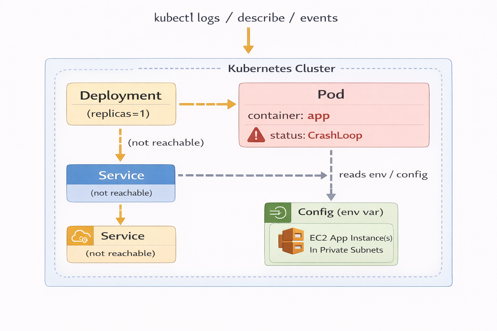
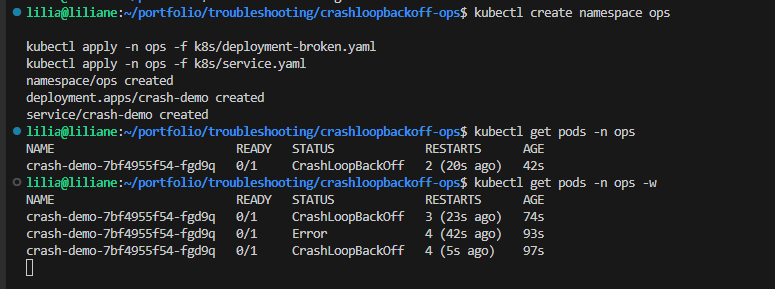
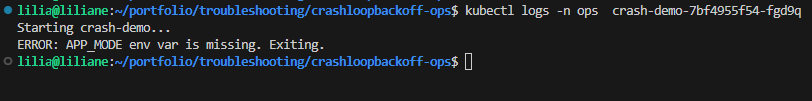
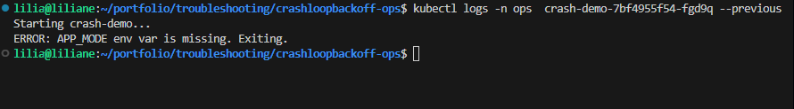
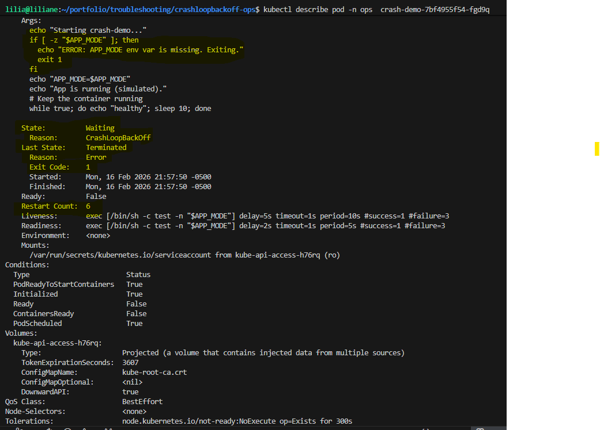
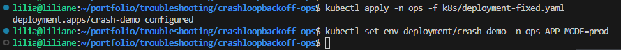
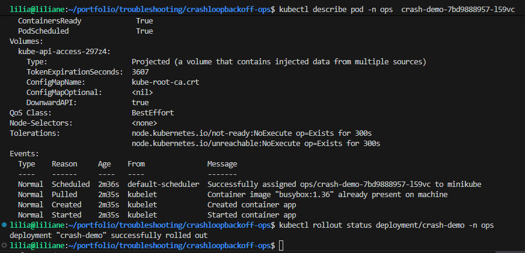
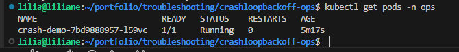
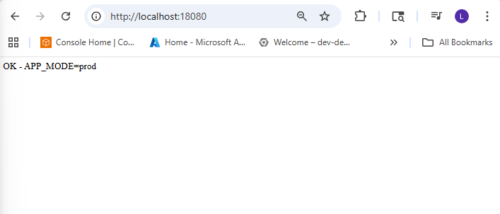

# Kubernetes: CrashLoopBackOff (Real “Ops” Scenario)

A pod that *should* stay up keeps restarting. I treat this like a real ops issue: I confirm the symptom, collect evidence (`logs`, `describe`, events), identify the root cause, apply a fix, and verify the rollout.

---

## Problem

In Kubernetes, a pod can enter **CrashLoopBackOff** when the container starts, fails, restarts, fails again… and Kubernetes backs off between retries.

What I saw:

- Deployment exists, but pods never stay `Ready`
- Pod status shows: `CrashLoopBackOff`
- App is not reachable through the Service

The key ops question is: **what is the container failing on right after it starts?**

---

## Solution

My workflow is always:

1. **Confirm the crash pattern** (`kubectl get pods -w`)
2. **Pull the logs** (current + previous crash)
3. **Describe the pod** to see events, probes, and the exact exit reason
4. **Identify the root cause** (misconfig, missing env var, bad image, wrong port, permission, etc.)
5. **Apply the fix** (ConfigMap/Secret/env/command/image/port)
6. **Verify stability** (pods Ready, no restarts, rollout success)

For this demo, I simulate a common real-world failure:

- The app requires an environment variable `APP_MODE`
- It’s missing, so the app exits with code `1`, causing CrashLoopBackOff
- Fix: add the missing env var in the Deployment and restart/rollout

---

## Architecture Diagram




---

## Step-by-step CLI 

> **Project namespace + app name used below**

* Namespace: `ops`
* App: `crash-demo`


---

### 1) Reproduce the issue (pod keeps restarting)

```bash
kubectl create namespace ops

kubectl apply -n ops -f k8s/deployment-broken.yaml
kubectl apply -n ops -f k8s/service.yaml

kubectl get pods -n ops
kubectl get pods -n ops -w
```

Expected symptom:

* `STATUS` becomes `CrashLoopBackOff`
* `RESTARTS` keeps increasing

**Screenshot — CrashLoopBackOff happening**

> Run the watch command and screenshot the output when you see `CrashLoopBackOff`.

```bash
kubectl get pods -n ops -w
```



---

### 2) Quickly confirm which pod is crashing

```bash
kubectl get pods -n ops -o wide
```

Copy the pod name (example): `crash-demo-7c8d9c7b6d-abcde`

---

### 3) Check logs (current crash)

```bash
kubectl logs -n ops <pod-name>
```

**Screenshot — Logs show the failure**

> Screenshot the log output that shows the error message.



---

### 4) Check logs from the *previous* container run (super important)

When the container restarts fast, the best clues are often in the previous run:

```bash
kubectl logs -n ops crash-demo-7c8d9c7b6d-abcde --previous
```

Example failures we might see:

* “Missing env var APP_MODE”
* “Cannot connect to DB”
* “Module not found”
* “Permission denied”
* “Bind: address already in use”

**Screenshot — Previous logs (best clue)**

> Screenshot `--previous` output (this is usually the real root-cause clue).

```bash
kubectl logs -n ops <pod-name> --previous
```



---

### 5) Describe the pod (events + exit reason)

```bash
kubectl describe pod -n ops crash-demo-7c8d9c7b6d-abcde
```

What I look for inside `describe`:

* **Last State** (Exit Code / Reason)
* **Events** at the bottom (Back-off restarting failed container)
* Wrong image / ImagePullBackOff (different issue but still visible here)
* Probe failures (liveness/readiness killing the pod)

**Screenshot — Describe output (exit code + events)**

> Screenshot the “Last State” + the Events at the bottom.

```bash
kubectl describe pod -n ops <pod-name>
```



---

### 6) Confirm rollout status (it will usually fail)

```bash
kubectl rollout status deployment/crash-demo -n ops
kubectl describe deployment crash-demo -n ops
```

*(In CrashLoopBackOff cases, rollout often hangs/fails until the root cause is fixed.)*

---

### 7) Fix the root cause (add missing env var)

In this demo: add `APP_MODE=prod` to the deployment.

Option A — apply the fixed manifest:

```bash
kubectl apply -n ops -f k8s/deployment-fixed.yaml
```

Option B — patch it directly (real ops style when you need a quick fix):

```bash
kubectl set env deployment/crash-demo -n ops APP_MODE=prod
```

**Screenshot — Fix applied**

> Screenshot the command output confirming the env var was set / deployment updated.

```bash
kubectl set env deployment/crash-demo -n ops APP_MODE=prod
```



---

### 8) Verify the fix (pods stable + ready)

```bash
kubectl get pods -n ops -w
kubectl rollout status deployment/crash-demo -n ops

kubectl get pods -n ops
kubectl describe pod -n ops <new-pod-name>
```

You want:

* `STATUS: Running`
* `READY: 1/1`
* `RESTARTS` stops increasing
* rollout shows success

**Screenshot — Rollout success**

> Screenshot the rollout command when it shows success.

```bash
kubectl rollout status deployment/crash-demo -n ops
```



**Screenshot — Pods stable (no restarts increasing)**

> Screenshot the pods list showing Running + Ready with stable restarts.

```bash
kubectl get pods -n ops
```



---

### 9) Validate Service connectivity (port-forward + browser proof)

```bash
kubectl get svc -n ops
kubectl -n ops port-forward svc/crash-demo 18080:80 --address 0.0.0.0

```

Then open:

* `http://localhost:8080`

**Screenshot — Browser proof (port-forward)**

> Screenshot the browser page showing the app is reachable.



---

## Outcome

After the fix:

* Pod transitions from `CrashLoopBackOff` → `Running`
* Deployment rollout completes successfully
* Restarts stop increasing
* Service becomes reachable (validated with port-forward + browser test)
* I have logs + describe output saved as proof of root cause and resolution

---

## Troubleshooting (what I check fast in real ops)

### 1) App exits immediately (bad config / missing env var)

* **Signal:** logs show a clear error, exit code `1`
* **Fix:** correct env vars, ConfigMap/Secret, command args

```bash
kubectl logs -n ops <pod> --previous
kubectl describe pod -n ops <pod>
kubectl set env deployment/<deploy> -n ops KEY=value
```

### 2) Wrong container port / app listening on different port

* **Signal:** app runs but readiness probe fails, or service test fails
* **Fix:** align containerPort, service targetPort, and app listen port

```bash
kubectl describe pod -n ops <pod>
kubectl get svc -n ops -o yaml
kubectl get deploy -n ops <deploy> -o yaml
```

### 3) Readiness/Liveness probe killing the container

* **Signal:** events mention probe failure (HTTP 500, timeout)
* **Fix:** increase initialDelaySeconds, adjust path/port, fix app health endpoint

```bash
kubectl describe pod -n ops <pod>
kubectl get deploy -n ops <deploy> -o yaml
```

### 4) Image issues (ImagePullBackOff vs CrashLoopBackOff)

* **Signal:** can’t pull image or auth issue (usually not CrashLoop)
* **Fix:** correct image name/tag, registry credentials

```bash
kubectl describe pod -n ops <pod>
kubectl get events -n ops --sort-by=.metadata.creationTimestamp
```

### 5) Permission / filesystem write errors

* **Signal:** logs show “permission denied”
* **Fix:** securityContext, runAsUser/fsGroup, correct volume mounts

```bash
kubectl logs -n ops <pod> --previous
kubectl get pod -n ops <pod> -o yaml
```

---

✅ That’s my CrashLoopBackOff runbook the way I actually do it in ops: **verify → collect evidence → root cause → fix → prove it’s stable**.

