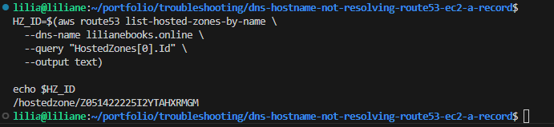

# DNS: Hostname Not Resolving (Route 53 → EC2 Public IP) — Real Ops Example (No App Running)

## Problem

My hostname was **not resolving**, so users couldn’t even reach the server IP behind the domain.

Real example setup:
- Domain: **lilianebooks.online**
- DNS: **AWS Route 53 (Public Hosted Zone)**
- Target: **EC2 Public IP**
- Record type: **A record → EC2 public IP**
- Note: In this example, **there is no app running yet**. My goal is **DNS correctness** first.

Typical symptoms I see when DNS is broken:
- `NXDOMAIN` (record not found)
- `SERVFAIL` (DNS failure / delegation / DNSSEC issues)
- Resolves on one resolver but not another (propagation/caching)
- Resolves to the wrong IP (wrong record value)

---

## Solution

I troubleshoot DNS like this:

1. Confirm Route 53 hosted zone exists for `lilianebooks.online`
2. Confirm the domain registrar is using the **Route 53 nameservers** (NS delegation)
3. Create/fix an **A record** pointing `lilianebooks.online` to the **EC2 public IP**
4. Validate using:
   - `dig` locally
   - `dig` against multiple public resolvers
   - `dig` against authoritative nameservers
   - `dig +trace` if anything looks wrong

---

## Architecture Diagram


---

## Step-by-step CLI (Route 53 + EC2 Public IP)

### 1) Get the EC2 public IP (this is what DNS must point to)

```bash
# List instances and find the right EC2 public IP

aws ec2 describe-instances \
  --query "Reservations[].Instances[].[InstanceId,State.Name,PublicIpAddress,Tags[?Key=='Name']|[0].Value]" \
  --output table
```

**Goal:** identify the exact **PublicIpAddress** you want to use.


✅ **What the screenshot should show**
- Your terminal showing the command + output table
- The **PublicIpAddress** clearly visible for the correct instance (and ideally the instance Name tag)

**Screenshot — EC2 public IP identified**


---

### 2) Confirm Route 53 hosted zone exists for the domain

```bash

aws route53 list-hosted-zones-by-name --dns-name lilianebooks.online
```

**Goal:** confirm Route 53 has the hosted zone for **lilianebooks.online** (public).

✅ **What the screenshot should show**
- Route 53 Console → **Hosted zones**
- The hosted zone **lilianebooks.online** visible
- Ideally you can see it’s a **Public hosted zone**

**Screenshot — Route 53 hosted zone exists**


---

### 3) Get the Hosted Zone ID

```bash

HZ_ID=$(aws route53 list-hosted-zones-by-name \
  --dns-name lilianebooks.online \
  --query "HostedZones[0].Id" \
  --output text)

echo $HZ_ID
```

**Goal:** capture hosted zone id so I can read/update records.

✅ **What the screenshot should show**
- Terminal output of `echo $HZ_ID`
- A value like `/hostedzone/Z1234567890ABC`

**Screenshot — Hosted Zone ID captured**


---

### 4) Check existing DNS records in the hosted zone

```bash

aws route53 list-resource-record-sets \
  --hosted-zone-id "$HZ_ID" \
  --output table
```

**Goal:** confirm whether an A record already exists for:
- `lilianebooks.online.`
- `www.lilianebooks.online.` (optional)

✅ **What the screenshot should show**
- Terminal output listing record sets (NS, SOA, and any existing A record)
- If A record already exists, show its **Value** and **TTL**

**Screenshot — Existing Route 53 records (baseline)**


---

### 5) Create/Update the A record to point to the EC2 Public IP

> Replace `EC2_PUBLIC_IP` with your real EC2 public IP.

```bash

EC2_PUBLIC_IP="X.X.X.X"

cat > /tmp/route53-root-a-record.json <<EOF
{
  "Comment": "Point lilianebooks.online to EC2 public IP (no app yet)",
  "Changes": [
    {
      "Action": "UPSERT",
      "ResourceRecordSet": {
        "Name": "lilianebooks.online",
        "Type": "A",
        "TTL": 60,
        "ResourceRecords": [
          { "Value": "$EC2_PUBLIC_IP" }
        ]
      }
    }
  ]
}
EOF

aws route53 change-resource-record-sets \
  --hosted-zone-id "$HZ_ID" \
  --change-batch file:///tmp/route53-root-a-record.json
```

**Goal:** root domain resolves to the EC2 public IP (low TTL helps for faster updates).

✅ **What the screenshot should show**
- Route 53 Console → Hosted zone → **Records**
- The **A record** for `lilianebooks.online`
- Value equals your **EC2 public IP**
- TTL visible (e.g., 60)

**Screenshot — A record points to EC2 public IP**


---

### 6) (Optional) Add `www` A record too

```bash
cat > /tmp/route53-www-a-record.json <<EOF
{
  "Comment": "Point www.lilianebooks.online to EC2 public IP (no app yet)",
  "Changes": [
    {
      "Action": "UPSERT",
      "ResourceRecordSet": {
        "Name": "www.lilianebooks.online",
        "Type": "A",
        "TTL": 60,
        "ResourceRecords": [
          { "Value": "$EC2_PUBLIC_IP" }
        ]
      }
    }
  ]
}
EOF

aws route53 change-resource-record-sets \
  --hosted-zone-id "$HZ_ID" \
  --change-batch file:///tmp/route53-www-a-record.json
```

✅ **What the screenshot should show (optional)**
- Route 53 record list with **www.lilianebooks.online** A record also pointing to EC2 IP

**Screenshot — Optional www A record**


---

## DNS Record Validation (dig + multiple resolvers)

### 7) Confirm nameserver delegation (critical)

```bash
dig NS lilianebooks.online +short
```

**Goal:** confirm your domain is delegated to the correct Route 53 nameservers.

If your registrar is not using these nameservers, DNS will fail even if Route 53 looks perfect.

✅ **What the screenshot should show**
- Terminal output listing Route 53 NS values (4 nameservers)

**Screenshot — NS delegation output**


---

### 8) Baseline check (your default resolver)

```bash
dig lilianebooks.online A +short
dig www.lilianebooks.online A +short
```

**Expected:** the EC2 public IP (`X.X.X.X`).

✅ **What the screenshot should show**
- Terminal output showing the returned IP(s)
- The IP matches your EC2 public IP

**Screenshot — Baseline dig results**


---

### 9) Validate using multiple public resolvers (real propagation check)

```bash
# Google DNS

dig @8.8.8.8 lilianebooks.online A +noall +answer

# Cloudflare DNS

dig @1.1.1.1 lilianebooks.online A +noall +answer

# Quad9

dig @9.9.9.9 lilianebooks.online A +noall +answer
```

**Goal:** confirm all resolvers return the same A record.

✅ **What the screenshot should show (Google)**
- Output includes `lilianebooks.online. 60 IN A X.X.X.X`

**Screenshot — Google resolver returns the right IP**


✅ **What the screenshot should show (Cloudflare)**
- Output includes `lilianebooks.online. 60 IN A X.X.X.X`

**Screenshot — Cloudflare resolver returns the right IP**


---

### 10) Query the authoritative nameserver directly (source of truth)

Get the nameservers first:

```bash

dig NS lilianebooks.online +short
```

Pick one NS from the output:

```bash

dig @<one-of-the-ns-from-output> lilianebooks.online A +noall +answer
```

**Goal:** confirm Route 53 is serving the correct A record even if caches exist elsewhere.

✅ **What the screenshot should show**
- The `dig @<authoritative-ns> ...` command
- The answer section returning `A X.X.X.X` (your EC2 IP)

**Screenshot — Authoritative Route 53 NS returns the right IP**


---

### 11) If it still fails: trace the whole DNS path

```bash
dig lilianebooks.online +trace
```

**Goal:** see exactly where DNS breaks (wrong delegation is the #1 real issue).

✅ **What the screenshot should show**
- The trace output walking from root → TLD → authoritative NS
- The point where it fails (if broken) OR the final successful answer

**Screenshot — dig +trace proof**


---

---

## Outcome

After the fix:

- ✅ Route 53 hosted zone exists for **lilianebooks.online**
- ✅ Nameserver delegation points to Route 53
- ✅ `lilianebooks.online` resolves to the **EC2 public IP**
- ✅ The answer is consistent across multiple resolvers (Google/Cloudflare/Quad9)
- ✅ Authoritative Route 53 nameserver returns the correct A record

**Important note:** Even with DNS fixed, the browser may still show **connection refused / timeout** if **no app** (or no open port) is running on the EC2 instance. That’s expected in this example — DNS correctness comes first.

---

## Troubleshooting

### 1) NXDOMAIN (record not found)

**Cause:** missing A record in Route 53  
**Fix:** create/UPSERT the A record and verify:

```bash
dig @1.1.1.1 lilianebooks.online A +noall +answer
```

✅ **What the screenshot should show**
- The failing response (NXDOMAIN) **before**
- The correct response **after** the fix
- A short note: “Fix was A record missing” (or similar)

**Screenshot — Troubleshooting notes (NXDOMAIN → fixed)**


---

### 2) Wrong nameservers at registrar (most common real issue)

**Cause:** registrar still points to old DNS provider  
**Fix:** update registrar nameservers to match Route 53 NS  
Verify:

```bash
dig NS lilianebooks.online +short
```

✅ **What the screenshot should show**
- The registrar nameserver page (Namecheap or your registrar) showing Route 53 NS
- Or terminal output showing the new NS values after update

(Use the same troubleshooting screenshot file if you want everything in one place.)

---

### 3) Resolves on one resolver but not another

**Cause:** caching/propagation delay  
**Fix:** wait for TTL to expire (or keep TTL low during changes)  
Verify:

```bash
dig @8.8.8.8 lilianebooks.online A +noall +answer
dig @1.1.1.1 lilianebooks.online A +noall +answer
dig @9.9.9.9 lilianebooks.online A +noall +answer
```

✅ **What the screenshot should show**
- Side-by-side (or sequential) outputs from multiple resolvers
- Showing consistency once propagation completes

---

### 4) Wrong IP returned

**Cause:** A record points to the wrong EC2 public IP (or IP changed after restart)  
**Fix:** update Route 53 record to the correct public IP  
Check current:

```bash
dig lilianebooks.online A +short
```

✅ **What the screenshot should show**
- Wrong IP result before
- Updated Route 53 record value
- Correct IP result after

---

### 5) SERVFAIL

**Cause:** delegation/DNSSEC/authoritative issues  
**Fix:** run trace and confirm NS:

```bash
dig lilianebooks.online +trace
dig NS lilianebooks.online +short
```

✅ **What the screenshot should show**
- `SERVFAIL` output (if it happened)
- `dig +trace` showing exactly where it breaks
- Your note about the fix (delegation/DNSSEC)


