Here’s the updated version in the structure you asked for:

# DNS: Hostname Not Resolving

## Route 53 → EC2 Public IP — Real Ops Example

## Context

In real operations work, users cannot reach anything if DNS is broken. Before worrying about the app, load balancer, or server configuration, I first make sure the hostname resolves correctly.

In this project, I focused on a simple but very real issue: **the domain was not resolving to the EC2 public IP**.

**Environment used**

* **Domain:** `lilianebooks.online`
* **DNS provider:** AWS Route 53 Public Hosted Zone
* **Target:** EC2 Public IP
* **Record type:** A record
* **Important note:** there is **no app running yet** in this example. My goal here is to prove **DNS correctness first**.

This is a real Ops mindset: fix the foundation first, then move up the stack.

---

## Problem

When DNS is broken, users cannot even find the server behind the domain.

Typical symptoms in a real environment include:

* **NXDOMAIN** because the record does not exist
* **SERVFAIL** because delegation or DNS settings are broken
* Domain resolves on one resolver but not another
* Domain resolves to the **wrong IP**
* Browser cannot reach the host because the name never resolves correctly

In this case, the core problem was simple:

> The hostname was not resolving correctly to the EC2 public IP, so the domain could not reliably direct traffic to the server.

Even if the server is healthy, DNS failure makes the service look down.

---

## Solution

I fixed the issue by validating the full DNS path from Route 53 to the public internet.

My solution was to:

* Confirm the **Route 53 hosted zone** exists for the domain
* Confirm the domain is delegated to the correct **Route 53 nameservers**
* Create or correct the **A record** to point to the EC2 public IP
* Validate the answer using:

  * local resolver checks
  * public resolvers like Google and Cloudflare
  * authoritative nameserver checks
  * full DNS trace when needed

This approach helped me separate:

* **DNS problems**
  from
* **application/network problems**

That distinction matters in real troubleshooting.

---

## Architecture

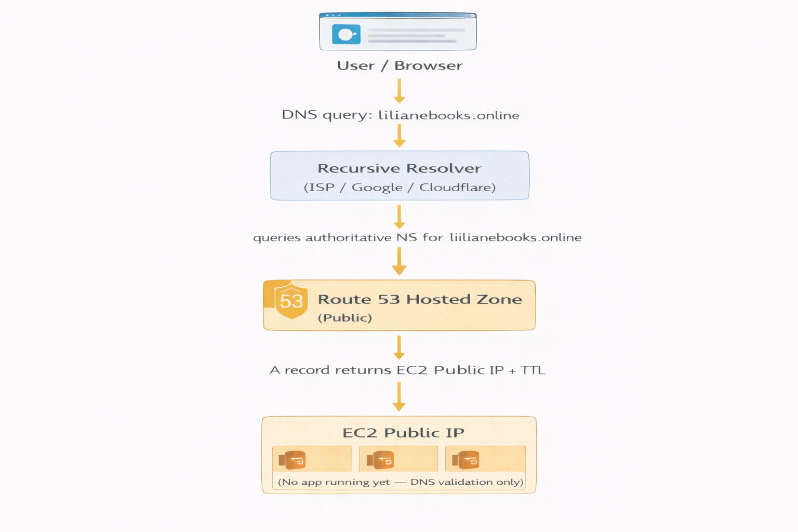

**Architecture summary**

* Internet users query DNS for `lilianebooks.online`
* The domain is hosted in a **Route 53 Public Hosted Zone**
* Route 53 returns an **A record**
* That A record points directly to the **EC2 public IP**
* No application is running yet, so this project proves **name resolution only**

---

## Workflow

### 1. Identify the correct EC2 public IP

**Goal:** make sure DNS points to the right destination.

Before touching Route 53, I first verified the exact public IP of the EC2 instance I wanted the domain to use. This avoids a very common mistake in Ops work: fixing DNS but pointing it to the wrong server.

**Screenshot — EC2 public IP identified**
What it should show:

* The EC2 instance details
* The correct **Public IPv4 address**
* Clear proof that this is the target IP for DNS

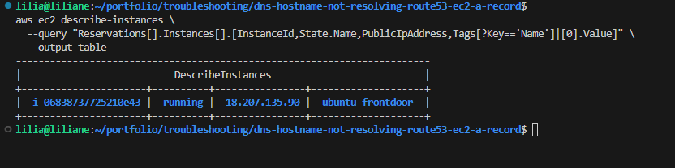

---

### 2. Confirm the Route 53 hosted zone exists

**Goal:** verify AWS is actually hosting DNS for the domain.

I checked that the hosted zone for `lilianebooks.online` exists and is set up as a **public hosted zone**. If the zone does not exist, Route 53 cannot answer queries for the domain.

**Screenshot — Route 53 hosted zone exists**
What it should show:

* Route 53 **Hosted zones**
* `lilianebooks.online`
* Hosted zone visible as **Public**

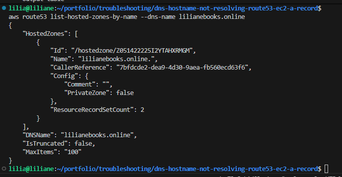

---

### 3. Review the existing DNS records

**Goal:** understand the current DNS state before making changes.

I reviewed the zone records to confirm whether the root domain already had an A record and whether the current value matched the EC2 public IP.

This step is important because sometimes the record exists, but the value is outdated or incorrect.

**Screenshot — Existing Route 53 records baseline**
What it should show:

* NS and SOA records
* Existing A record if present
* Baseline view before correction

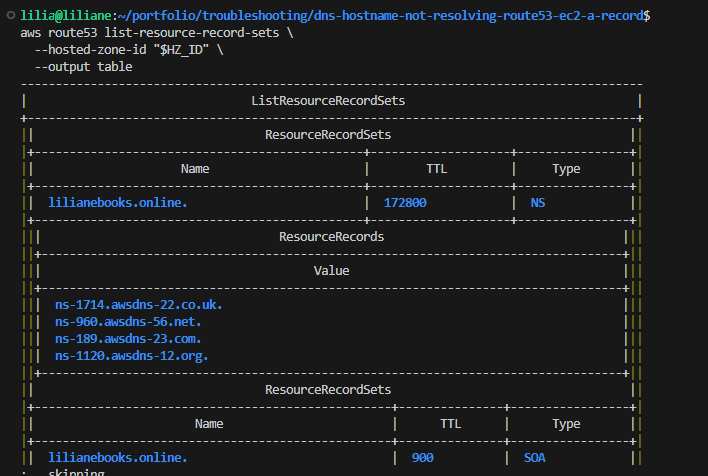

---

### 4. Create or correct the A record

**Goal:** make the root domain resolve to the EC2 public IP.

I then created or updated the A record for `lilianebooks.online` so it points directly to the EC2 public IP.

This is the actual fix that ties the domain name to the server.

**Screenshot — A record points to EC2 public IP**
What it should show:

* Route 53 record list
* `lilianebooks.online` A record
* Value matching the EC2 public IP
* TTL visible

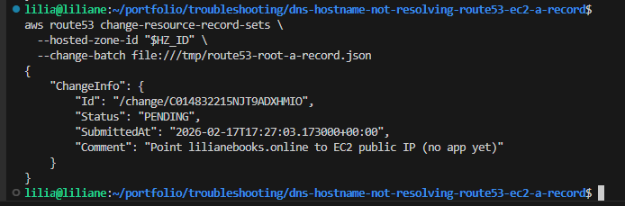

---

### 5. Optionally add the `www` record

**Goal:** make both root and `www` resolve consistently if needed.

If I want users to reach the same destination using `www.lilianebooks.online`, I add that record too. This avoids inconsistency where one hostname works and the other fails.

**Screenshot — Optional www A record**
What it should show:

* `www.lilianebooks.online`
* A record pointing to the same EC2 public IP

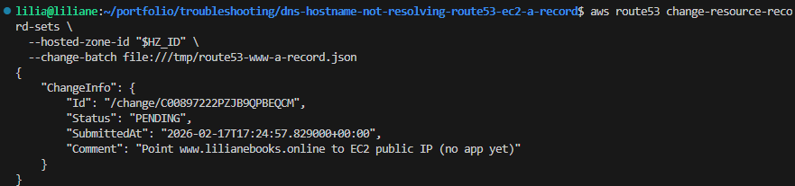

---

### 6. Validate nameserver delegation

**Goal:** prove the registrar is pointing to Route 53.

This is one of the most important checks in real DNS troubleshooting. Route 53 can look perfectly configured, but if the registrar is not using the Route 53 nameservers, the internet will never get the correct answer.

**Screenshot — NS delegation output**
What it should show:

* The domain returning Route 53 nameservers
* Clear proof that delegation is correct

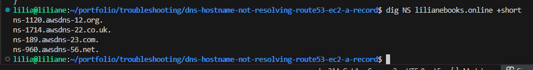

---

### 7. Validate DNS resolution from normal resolver path

**Goal:** confirm the domain resolves to the expected public IP.

After the A record was set, I checked whether the domain returned the correct IP through normal DNS resolution.

This confirms the hostname is now usable from a client perspective.

**Screenshot — Baseline dig results**
What it should show:

* `lilianebooks.online`
* Returned A record
* IP matches the EC2 public IP

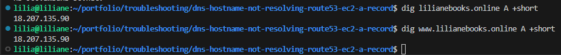

---

### 8. Validate across public resolvers

**Goal:** confirm consistency across multiple DNS providers.

I validated the record using public resolvers such as Google DNS and Cloudflare DNS. This helps confirm the fix is visible beyond the local machine and reduces the chance that I’m only seeing cached/local results.

**Screenshot — Google resolver returns the right IP**
What it should show:

* Resolver answer from Google DNS
* Correct A record value

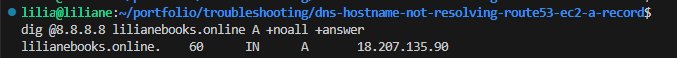

**Screenshot — Cloudflare resolver returns the right IP**
What it should show:

* Resolver answer from Cloudflare DNS
* Correct A record value

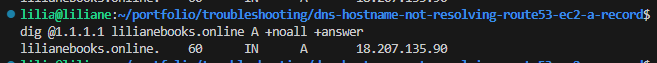

---

### 9. Validate against the authoritative nameserver

**Goal:** verify the source of truth is correct.

I queried one of the Route 53 authoritative nameservers directly. This is one of the best ways to prove the Route 53 zone itself is serving the right answer, even if public resolvers still have stale cache.

**Screenshot — Authoritative Route 53 NS returns the right IP**
What it should show:

* Direct query to one Route 53 nameserver
* Correct A record answer

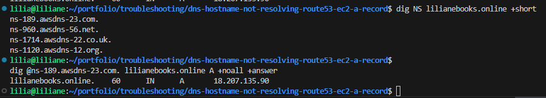

---

### 10. Trace DNS if anything still looks wrong

**Goal:** find exactly where resolution breaks.

If a resolver still fails, I use a DNS trace to follow the request from root servers to the final authoritative answer. This is how I isolate issues like bad delegation, missing NS updates, or other upstream problems.

**Screenshot — dig trace proof**
What it should show:

* DNS path from root to authoritative nameserver
* Either successful resolution or the exact break point

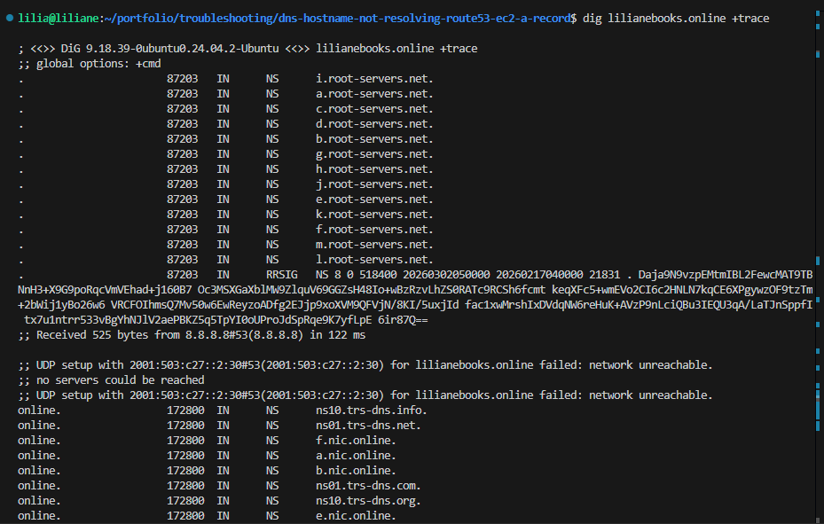

---

## Business Impact

This project shows a very practical Ops skill: **I can troubleshoot DNS issues methodically instead of guessing**.

Business value of this work:

* Restores reachability to the environment at the DNS layer
* Reduces downtime caused by domain misconfiguration
* Separates DNS problems from app/network/server problems faster
* Speeds up incident response by validating delegation, record value, and authoritative answers
* Creates clean evidence that the infrastructure layer is correct before app deployment begins

This is important because many production incidents look like “the app is down” when the real issue is simply DNS.

---

## Troubleshooting

### 1. NXDOMAIN

**What it means:** the record does not exist.

**Likely cause:** missing A record in Route 53.

**How I handle it:**

* Check whether the root record exists
* Create or update the missing A record
* Re-test using a resolver and the authoritative nameserver

---

### 2. Wrong nameservers at the registrar

**What it means:** Route 53 is configured, but the domain is still delegated somewhere else.

**Likely cause:** registrar nameservers were not updated to Route 53.

**How I handle it:**

* Compare registrar NS values with the Route 53 hosted zone NS values
* Update the registrar if they do not match
* Re-check delegation after propagation

This is one of the most common real-world DNS issues.

---

### 3. Different answers from different resolvers

**What it means:** some resolvers have the new record, others still have cached data.

**Likely cause:** propagation delay or TTL caching.

**How I handle it:**

* Query multiple public resolvers
* Keep TTL low during changes
* Wait for propagation if authoritative DNS is already correct

---

### 4. Wrong IP returned

**What it means:** the record exists, but points to the wrong destination.

**Likely cause:** old public IP, wrong instance selected, or server IP changed.

**How I handle it:**

* Reconfirm the actual EC2 public IP
* Compare it to the Route 53 A record value
* Update the record if needed

---

### 5. SERVFAIL

**What it means:** the DNS query is failing at a deeper level.

**Likely cause:** delegation issue, DNSSEC issue, or authoritative resolution problem.

**How I handle it:**

* Check nameserver delegation
* Query the authoritative nameserver directly
* Run a full trace to find where resolution breaks

---

### 6. Domain resolves, but browser still fails

**What it means:** DNS is working, but the service is not reachable.

**Likely cause:**

* no app is running
* web server is not listening
* security group does not allow the port
* instance is down

**How I handle it:**

* First confirm DNS is returning the correct IP
* Then move to EC2/network/application troubleshooting

In this project, that outcome is expected because there is **no app running yet**.

---

## Useful CLI

### Core validation commands

```bash
aws ec2 describe-instances \
  --query "Reservations[].Instances[].[InstanceId,State.Name,PublicIpAddress,Tags[?Key=='Name']|[0].Value]" \
  --output table
```

```bash
aws route53 list-hosted-zones-by-name --dns-name lilianebooks.online
```

```bash
aws route53 list-resource-record-sets \
  --hosted-zone-id "$HZ_ID" \
  --output table
```

```bash
dig NS lilianebooks.online +short
```

```bash
dig lilianebooks.online A +short
```

```bash
dig @8.8.8.8 lilianebooks.online A +noall +answer
```

```bash
dig @1.1.1.1 lilianebooks.online A +noall +answer
```

```bash
dig @<authoritative-ns> lilianebooks.online A +noall +answer
```

```bash
dig lilianebooks.online +trace
```

---

### Troubleshooting CLI

**Check delegation**

```bash
dig NS lilianebooks.online +short
```

**Check local/default resolver**

```bash
dig lilianebooks.online A +short
```

**Check Google DNS**

```bash
dig @8.8.8.8 lilianebooks.online A +noall +answer
```

**Check Cloudflare DNS**

```bash
dig @1.1.1.1 lilianebooks.online A +noall +answer
```

**Check authoritative answer**

```bash
dig @<authoritative-ns> lilianebooks.online A +noall +answer
```

**Trace full resolution**

```bash
dig lilianebooks.online +trace
```

**Check if the server itself is reachable after DNS is fixed**

```bash
curl -I http://lilianebooks.online
```

**Check whether the returned IP matches the EC2 public IP**

```bash
dig lilianebooks.online A +short
```

---

## Cleanup

If I no longer want this DNS setup, cleanup is simple:

* Remove the A record for `lilianebooks.online`
* Remove the `www` record if I created it
* Delete the Route 53 hosted zone if it is no longer needed
* Release or stop the EC2 instance if it was only used for testing

If I plan to continue the project later, I usually keep:

* the hosted zone
* the domain delegation
* the record structure


