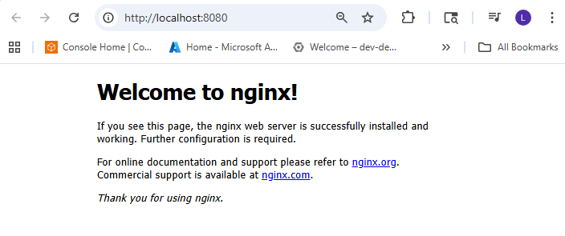

# Kubernetes Troubleshooting: ImagePullBackOff (Real “Ops” Scenario)

When Kubernetes shows **ImagePullBackOff**, it means the node (kubelet) **cannot pull the container image** from the registry.  
In real ops, this is a production blocker: the Deployment exists, but **pods never start**, so the Service has **zero endpoints**.

This README is a **real reproducible example** you can run on **Minikube** and screenshot like a real incident.

---

## Problem

A new deployment was rolled out, but the pods are stuck in:

- `ErrImagePull`
- `ImagePullBackOff`

Users can’t access the app because nothing is running.

---

## Solution

I fix ImagePullBackOff in this order:

1. Confirm the failure (pods)
2. Read **Events** to get the exact reason
3. Verify the image name/tag (most common issue)
4. Verify registry access + credentials (if private)
5. Restart rollout and confirm service endpoints are healthy again

---

## Architecture Diagram


---

## Step-by-step CLI 

### Scenario

We deploy a simple NGINX app but use a **bad image tag** on purpose to trigger the incident.

* Namespace: `ops-demo`
* App: `web`
* Bad image: `nginx:1.99.99` (tag does not exist → ImagePullBackOff)
* Fix: update to `nginx:1.25.3` (valid tag)

---

### Prep — Create screenshots folder 

```bash
mkdir -p screenshots
```

---

### Step 1 — Create namespace (clean ops demo)

**Goal:** isolate troubleshooting in its own namespace.

```bash
kubectl create ns ops-demo
```

Verify:

```bash
kubectl get ns | grep ops-demo
```

**Screenshot — Namespace created**


---

### Step 2 — Deploy the broken app (this creates ImagePullBackOff)

**Goal:** reproduce a real incident with a wrong image tag.

```bash
kubectl -n ops-demo create deployment web --image=nginx:1.99.99
kubectl -n ops-demo expose deployment web --port=80 --type=ClusterIP
```

Check pods:

```bash
kubectl -n ops-demo get pods -o wide
```

**Screenshot — Pods stuck in ImagePullBackOff**


---

### Step 3 — Describe the pod and read events (this is the key)

**Goal:** get the exact pull error from Kubernetes events.

Get pod name:

```bash
kubectl -n ops-demo get pods
```

Describe it (copy the pod name from the command above):

```bash
kubectl -n ops-demo describe pod <pod-name>
```

In **Events**, you will usually see:

* `Failed to pull image "nginx:1.99.99": ... not found`
* `ErrImagePull`
* `ImagePullBackOff`

**Screenshot — Describe pod (Events show image pull failure)**


---

### Step 4 — Confirm what image the Deployment is trying to pull

**Goal:** verify the wrong tag is really in the deployment spec.

```bash
kubectl -n ops-demo get deploy web -o jsonpath='{.spec.template.spec.containers[0].image}{"\n"}'
```

Expected:

```text
nginx:1.99.99
```

**Screenshot — Deployment image (shows bad tag)**


---

### Step 5 — Check events (sorted) to confirm repeated failures

**Goal:** prove the cluster is repeatedly failing to pull.

```bash
kubectl -n ops-demo get events --sort-by=.lastTimestamp | tail -n 30
```

**Screenshot — Events sorted (repeated pull failures)**


---

### Step 6 — Fix the issue (update to a real tag)

**Goal:** correct the image tag and trigger a clean rollout.

```bash
kubectl -n ops-demo set image deploy/web web=nginx:1.25.3
kubectl -n ops-demo set image deploy/web nginx=nginx:1.25.3

```

Watch rollout:

```bash
kubectl -n ops-demo rollout status deploy/web
```

**Screenshot — Rollout status (recovery in progress / success)**


---

### Step 7 — Confirm pods are Running + Ready

**Goal:** verify full recovery.

```bash
kubectl -n ops-demo get pods -o wide
```

Expected:

* `STATUS: Running`
* `READY: 2/2`

**Screenshot — Pods Running/Ready**


---

### Step 8 — Confirm Service endpoints exist again

**Goal:** prove the Service now has healthy endpoints.

```bash
kubectl -n ops-demo get svc web
kubectl -n ops-demo get endpoints web
```

Expected endpoints should show pod IP(s).

**Screenshot — Service + endpoints recovered**


---

### Step 9 — (Optional) Prove the app works (port-forward)

**Goal:** open in browser and show success page.

```bash
kubectl -n ops-demo port-forward svc/web 8080:80
```

Open browser:

* [http://localhost:8080](http://localhost:8080)

Stop port-forward with:

* `CTRL + C`

**Screenshot — Browser success (NGINX page loads)**


---

---

## Outcome

* I reproduced a real ImagePullBackOff failure using a bad image tag
* I confirmed the root cause using **kubectl describe** + **events**
* I corrected the deployment image tag and restarted rollout
* Pods became **Running/Ready**
* The Service endpoints recovered and the app became reachable again

---

## Troubleshooting (Real Ops Checklist)

### 1) Wrong image tag / repo path (MOST common)

**Symptoms**

* `manifest unknown`
* `not found`
* `Failed to pull image ...`

**Fix**

```bash
kubectl -n <ns> set image deploy/<deploy> <container>=<image>:<real-tag>
kubectl -n <ns> rollout status deploy/<deploy>
```

---

### 2) Private registry auth (unauthorized)

**Symptoms**

* `unauthorized: authentication required`

**Fix (DockerHub example)**

```bash
kubectl create secret docker-registry regcred \
  --docker-server=https://index.docker.io/v1/ \
  --docker-username='<DOCKERHUB_USERNAME>' \
  --docker-password='<DOCKERHUB_TOKEN_OR_PASSWORD>' \
  --docker-email='<EMAIL>' \
  -n <namespace>
```

Attach it to the default ServiceAccount:

```bash
kubectl patch serviceaccount default -n <namespace> \
  -p '{"imagePullSecrets": [{"name": "regcred"}]}'
```

Restart rollout:

```bash
kubectl rollout restart deploy/<deploy-name> -n <namespace>
kubectl rollout status deploy/<deploy-name> -n <namespace>
```

---

### 3) Network/DNS problems (registry unreachable)

**Symptoms**

* `i/o timeout`
* `dial tcp`
* DNS resolution failures

**Quick checks**

```bash
kubectl -n kube-system get pods | grep -i coredns
kubectl -n kube-system logs -l k8s-app=kube-dns --tail=50
```

---

### 4) DockerHub rate limits

**Symptoms**

* pull denied / too many requests

**Fix**

* Use authenticated pulls (imagePullSecret)
* Or use another registry (ECR/GCR/ACR) for production-like workflows

---

### 5) Secret exists but in the wrong namespace

**Symptoms**

* you created `regcred` but pods still fail

**Fix**

```bash
kubectl get secret -n <namespace>
```

---

### 6) You fixed it but old pods are still stuck

**Fix**

```bash
kubectl rollout restart deploy/<deploy-name> -n <namespace>
kubectl rollout status deploy/<deploy-name> -n <namespace>
```

---

## Cleanup

```bash
kubectl delete ns ops-demo
```


