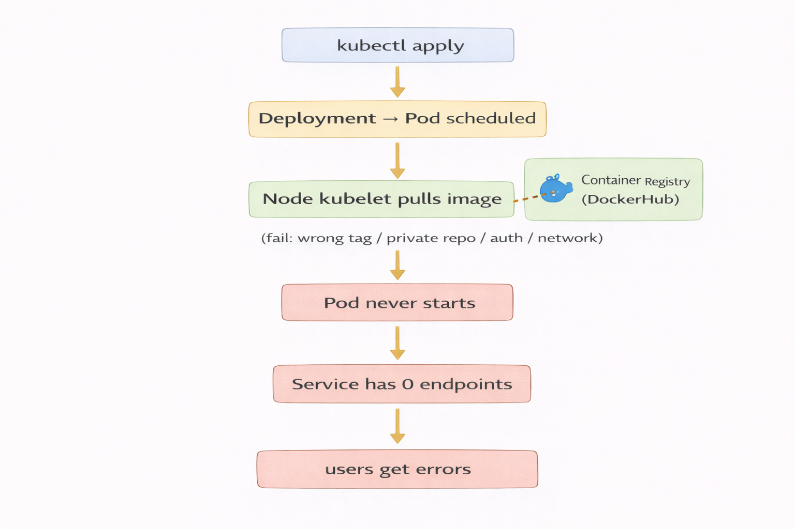
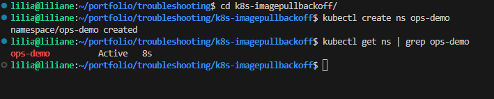
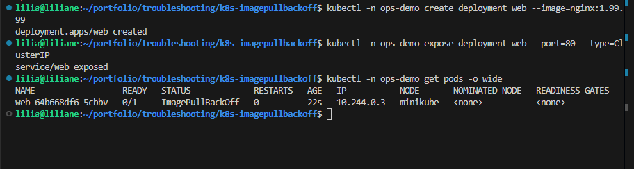
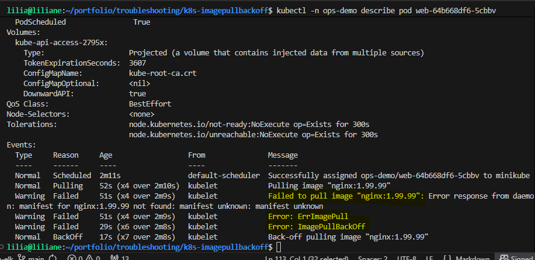
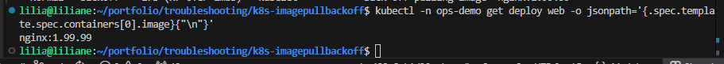
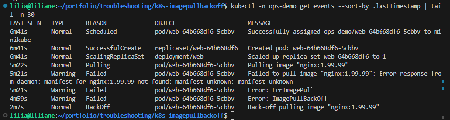
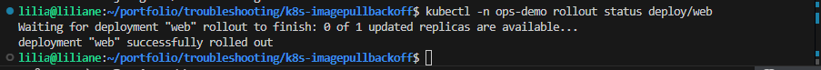
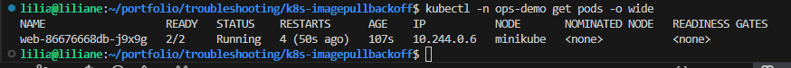
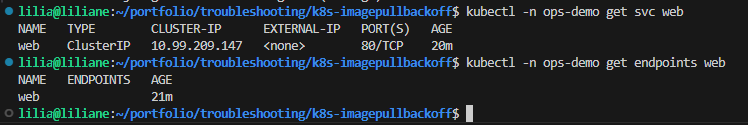

# Kubernetes Troubleshooting: ImagePullBackOff

## Context

This project demonstrates how I troubleshoot **ImagePullBackOff** in Kubernetes like a real operations incident.

In production, this issue is critical because the Deployment may exist, but the application never becomes available. The pods fail before startup because Kubernetes cannot pull the container image from the registry. That means the Service has no healthy backend pods, users cannot reach the app, and rollout stops at the infrastructure layer before the application even gets a chance to run.

I built this project as a **reproducible Minikube incident simulation** to show how I investigate the failure, identify the exact cause, apply the fix, and verify that service availability is fully restored.

---

## Problem

A new application rollout was triggered, but the pods never started successfully.

Instead of reaching a healthy state, Kubernetes reported:

* `ErrImagePull`
* `ImagePullBackOff`

From an operations perspective, this creates an immediate availability problem:

* the Deployment exists, but workloads are not running
* the Service has no valid endpoints
* the application is unreachable
* repeated pull failures generate noise in events and delay recovery

The core incident question becomes:

**Why is Kubernetes unable to pull the container image?**

---

## Solution

I approached the incident using a structured troubleshooting workflow.

First, I confirmed that the pods were failing with **ImagePullBackOff** rather than an application-level crash. Then I inspected the pod details and Kubernetes events to capture the exact pull error. After that, I validated the image configured in the Deployment and confirmed the root cause: the rollout was using an invalid image tag.

I fixed the Deployment by updating it to a valid image tag, monitored the rollout until recovery completed, and verified that the pods became healthy again. Finally, I confirmed that the Service endpoints were restored and that the application was reachable.

This reflects how I handle real incidents: **confirm → collect evidence → identify root cause → fix → verify recovery**.

---

## Architecture



This project uses a simple Kubernetes troubleshooting flow:

* A Deployment attempts to start an NGINX-based application
* Kubernetes tries to pull the image from the registry
* The image pull fails because of an invalid tag
* Pods remain unavailable and the Service has no healthy endpoints
* After correction, Kubernetes pulls the valid image successfully
* New pods become Running and Ready
* Service endpoints recover and traffic can flow again

---

## Workflow

### Scenario

I intentionally deployed a workload with a **bad container image tag** to simulate a realistic rollout failure.

Project scope:

* **Namespace:** `ops-demo`
* **Application:** `web`
* **Failure introduced:** invalid NGINX image tag
* **Recovery action:** update Deployment to a valid image tag
* **Validation target:** healthy pods, restored Service endpoints, working application

---

### Step 1 — Isolate the incident in a dedicated namespace

**Goal:** keep the troubleshooting scenario clean and separated from other workloads.

This step creates an isolated namespace for the incident simulation so all evidence, events, pods, and recovery actions stay contained in one place.

**Screenshot:**


---

### Step 2 — Trigger the incident with a broken deployment

**Goal:** reproduce a real ImagePullBackOff failure.

I deployed the application using an image tag that does not exist. This forced Kubernetes into a pull failure scenario and created the exact incident condition I wanted to troubleshoot.

**Screenshot:**


---

### Step 3 — Inspect pod events to capture the exact failure reason

**Goal:** collect evidence directly from Kubernetes.

This is the most important investigation step. Instead of guessing, I checked the pod details and events to find the exact reason the pull failed. The evidence clearly showed that the requested image could not be found.

That confirms this is not a networking issue inside the app, not a liveness/readiness problem, and not a CrashLoopBackOff case. The failure occurs before the container even starts.

**Screenshot:**


---

### Step 4 — Verify the image configured in the Deployment

**Goal:** confirm the wrong image reference is actually in the deployment spec.

After identifying the pull failure, I verified the image defined in the Deployment. This proves the incident is coming from the workload configuration itself and not from a temporary registry glitch.

**Screenshot:**


---

### Step 5 — Review repeated cluster events

**Goal:** prove the failure is persistent and recurring.

I reviewed the event stream to confirm Kubernetes was repeatedly attempting to pull the image and failing. This is useful in real operations because it shows the issue is ongoing and explains why pods never progress to Ready.

**Screenshot:**


---

### Step 6 — Correct the image and trigger recovery

**Goal:** replace the bad image reference with a valid one and restart the rollout safely.

Once the root cause was confirmed, I updated the Deployment to use a valid image tag. This allowed Kubernetes to pull the image successfully and begin recreating the workload.

**Screenshot:**


---

### Step 7 — Verify that pods recover successfully

**Goal:** confirm workloads are now healthy and stable.

After the fix, I checked that the new pods moved into a healthy state and stayed there. This is the first hard proof that the recovery action worked.

**Screenshot:**


---

### Step 8 — Confirm Service endpoints are restored

**Goal:** prove the application is now available behind the Service.

Healthy pods alone are not enough. I also verified that the Service recovered its endpoints. This matters because it proves traffic now has valid backend targets again.

**Screenshot:**


---

### Step 9 — Validate the application from the user side

**Goal:** confirm the app is reachable and functioning after recovery.

As a final validation step, I opened the application and confirmed the expected NGINX page loaded successfully. This closes the incident by proving recovery at the user-facing layer, not just the infrastructure layer.

**Screenshot:**


---

## Business Impact

This project highlights an important operational skill: diagnosing deployment failures **before they become extended outages**.

In a real environment, **ImagePullBackOff** can block releases, delay incident response, and create confusion because the Deployment object exists even though the application is unavailable. By troubleshooting the issue methodically, I reduce downtime, restore availability faster, and prevent wasted time on the wrong root-cause path.

This project demonstrates that I can:

* quickly identify rollout failures at the Kubernetes layer
* use platform evidence instead of assumptions
* isolate whether the issue is image-related, credentials-related, or registry-related
* apply targeted fixes with minimal disruption
* verify recovery end-to-end


---

## Troubleshooting

### Wrong image tag or wrong repository path

This is the most common cause of **ImagePullBackOff**.

Typical signs include:

* image not found
* manifest unknown
* repeated pull failures in pod events

The fix is to correct the image reference in the Deployment and verify a clean rollout.

---

### Private registry authentication failure

If the image is stored in a private registry, Kubernetes may fail to pull it because the workload has no valid credentials.

Typical signs include:

* unauthorized
* authentication required
* access denied to registry

The fix is to create the correct image pull secret in the same namespace and ensure the workload or service account uses it.

---

### Secret exists in the wrong namespace

A common operational mistake is creating the registry secret in one namespace while the Deployment runs in another.

Typical sign:

* credentials appear to exist, but pulls still fail

The fix is to verify the secret is present in the workload namespace and correctly referenced.

---

### Registry/network/DNS issue

Sometimes the image reference is valid, but the node cannot reach the registry.

Typical signs include:

* timeout errors
* DNS lookup failures
* TCP connection failures

In that case, the issue is not with the image itself but with node connectivity, DNS, proxy settings, or registry reachability.

---

### DockerHub or registry rate limiting

Unauthenticated pulls may hit rate limits, especially in shared or repeated lab environments.

Typical signs include:

* too many requests
* pull denied even with a valid image

The fix is to authenticate pulls or use a production-ready registry strategy.

---

### Old failed pods still visible after the fix

Sometimes the image is corrected, but failed pods remain visible for a short time during rollout.

This can make recovery look incomplete even when the new ReplicaSet is healthy. The correct response is to verify rollout state and confirm that the latest pods are the healthy ones tied to the updated deployment revision.

---

## Useful CLI

### Core incident validation

```bash
kubectl -n ops-demo get pods -o wide
kubectl -n ops-demo describe pod <pod-name>
kubectl -n ops-demo get events --sort-by=.lastTimestamp
kubectl -n ops-demo get deploy web -o jsonpath='{.spec.template.spec.containers[0].image}{"\n"}'
```

### Recovery validation

```bash
kubectl -n ops-demo rollout status deploy/web
kubectl -n ops-demo get pods
kubectl -n ops-demo get svc web
kubectl -n ops-demo get endpoints web
```

### Useful troubleshooting CLI

```bash
kubectl -n ops-demo describe deploy web
kubectl -n ops-demo get rs
kubectl -n ops-demo get pod <pod-name> -o yaml
kubectl get secret -n ops-demo
kubectl -n kube-system get pods
kubectl -n kube-system logs -l k8s-app=kube-dns --tail=50
kubectl -n ops-demo rollout history deploy/web
kubectl -n ops-demo rollout restart deploy/web
```

### Private registry troubleshooting CLI

```bash
kubectl get serviceaccount default -n ops-demo -o yaml
kubectl get secret regcred -n ops-demo -o yaml
kubectl describe serviceaccount default -n ops-demo
```

---

## Cleanup

After completing the troubleshooting exercise, I removed the demo namespace and all related resources to return the cluster to a clean state.

```bash
kubectl delete ns ops-demo
```


