# Kubernetes Troubleshooting: Ingress returns **404** or **503** (Real “Ops” Scenario)

Ingress exists, DNS looks right… but the browser shows **404 Not Found** or **503 Service Unavailable**.  
This is a real “Ops” issue I troubleshoot by validating **Ingress rules**, **Service ports**, **Endpoints**, and **Ingress controller logs** until traffic works again.

This README is a **simulated-from-scratch incident** (like a real on-call ticket), with an intentionally broken setup and the exact debugging path I take.

---

## Problem (Real Incident Simulation)

**Incident:** “App is deployed, but users can’t reach it through Ingress.”

Symptoms I saw:

- First: **404 Not Found** (Ingress reachable, but rule not matching)
- After fixing host/path: **503 Service Unavailable** (rule matches, but backend has no healthy endpoints / wrong port)

---

## Solution (My Fast Debug Order)

1. Reproduce with **curl + Host header** (confirm 404 vs 503).
2. Check **Ingress rules** (host/path/backend service/port).
3. Check **Ingress controller status + logs** (the truth).
4. Check **Service selector + ports/targetPort**.
5. Check **Endpoints/EndpointSlice** (if empty → service not selecting pods).
6. Check **Pods readiness + labels**.
7. Fix and verify with **curl + browser**.

---

## Architecture Diagram

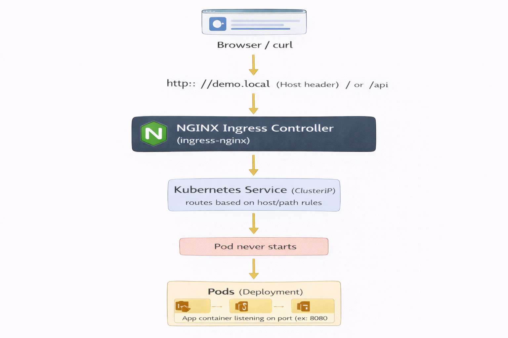


---

## Incident Walkthrough (Simulated From Scratch)

> Environment (example):
>
> * Cluster: **Minikube**
> * Namespace: `demo`
> * App: `demo-app`
> * Service: `demo-svc`
> * Ingress: `demo-ingress`
> * Host: `demo.local`

---

### 0) Setup: Enable Ingress Controller (Minikube)

```bash
minikube start
minikube addons enable ingress

kubectl get pods -n ingress-nginx
kubectl get svc  -n ingress-nginx

```

**Screenshot — Ingress controller running**
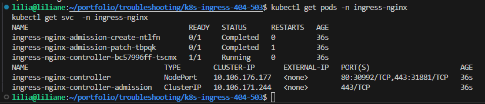

---

### 1) Deploy an intentionally broken setup (this simulates a real mistake)

I’m deploying a simple app + service + ingress, but I intentionally introduce 2 common mistakes:

* Mistake #1 (causes **404**): I test with the wrong host header first.
* Mistake #2 (causes **503**): Service selector doesn’t match pod labels **and** targetPort is wrong.


**manifests/01-deploy.yaml**

```yaml
apiVersion: apps/v1
kind: Deployment
metadata:
  name: demo-app
  namespace: demo
spec:
  replicas: 2
  selector:
    matchLabels:
      app: demo-app
  template:
    metadata:
      labels:
        app: demo-app
    spec:
      containers:
        - name: demo-app
          image: hashicorp/http-echo:0.2.3
          args:
            - "-text=hello from demo-app"
            - "-listen=:8080"
          ports:
            - containerPort: 8080
---
apiVersion: v1
kind: Namespace
metadata:
  name: demo
```

**manifests/02-service.yaml** (broken on purpose)

```yaml
apiVersion: v1
kind: Service
metadata:
  name: demo-svc
  namespace: demo
spec:
  type: ClusterIP
  selector:
    app: demo          # ❌ WRONG (pods are app=demo-app)
  ports:
    - name: http
      port: 80
      targetPort: 80   # ❌ WRONG (container listens on 8080)
```

**manifests/03-ingress.yaml**

```yaml
apiVersion: networking.k8s.io/v1
kind: Ingress
metadata:
  name: demo-ingress
  namespace: demo
spec:
  ingressClassName: nginx
  rules:
    - host: demo.local
      http:
        paths:
          - path: /
            pathType: Prefix
            backend:
              service:
                name: demo-svc
                port:
                  number: 80
```

Apply:

```bash
 kubectl create namespace demo
kubectl apply -f manifests/01-deploy.yaml
kubectl apply -f manifests/02-service.yaml
kubectl apply -f manifests/03-ingress.yaml
```

**Screenshot — Apply manifests**
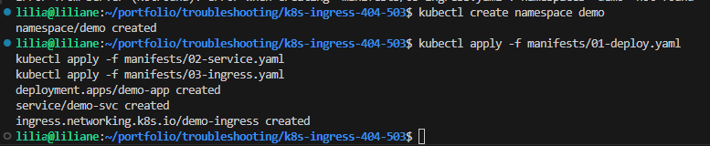

---

### 2) Reproduce the issue (I confirm: 404 vs 503)

First, I purposely test with the wrong Host header (this is a real mistake people make).

```bash
MINIKUBE_IP=$(minikube ip)

# ❌ WRONG host header (should be demo.local)
curl -i -H "Host: app.local" http://$MINIKUBE_IP/
```

Expected result: **404 Not Found**.

**Screenshot — 404 proof (wrong Host header)**
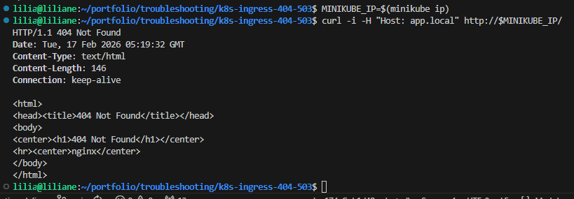

---

### 3) Check the Ingress rules (host/path/backend) and fix the Host mismatch

```bash
kubectl get ingress -n demo
kubectl describe ingress demo-ingress -n demo
kubectl get ingress demo-ingress -n demo -o yaml
```

What I verify:

* `ingressClassName: nginx`
* host is **demo.local**
* path is `/`
* backend is `demo-svc:80`

**Screenshot — Ingress describe**
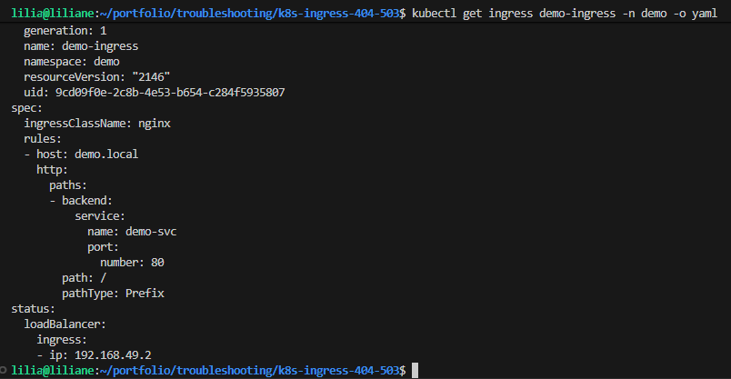

Now I retest with the correct Host header:

```bash
curl -i -H "Host: demo.local" http://$MINIKUBE_IP/
```

Now I get **503 Service Unavailable** (rule matches, but backend is broken).

**Screenshot — 503 proof (rule matches but backend unhealthy)**
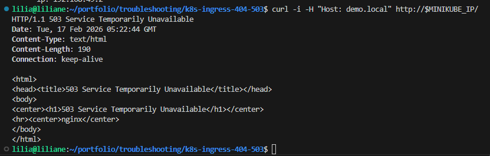

---

### 4) Check ingress controller logs (this tells me *why* it’s failing)

```bash
kubectl logs -n ingress-nginx deploy/ingress-nginx-controller --tail=200
```

What I look for:

* “no endpoints available”
* “service not found”
* upstream connect refused / timeout

**Screenshot — Controller logs showing “no endpoints”**
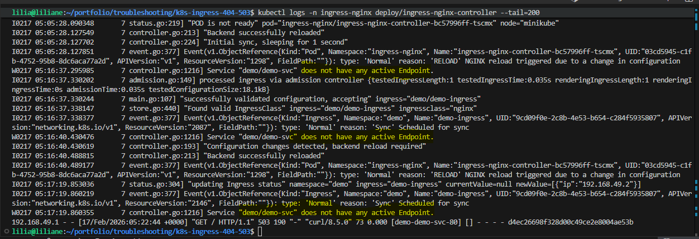

At this point, **503 almost always means endpoints are empty OR service points to the wrong port**.

---

### 5) Validate the Service (ports + selector)

```bash
kubectl describe svc demo-svc -n demo
kubectl get svc demo-svc -n demo -o yaml
```

What I spot immediately:

* selector: `app: demo` (but my pods are `app: demo-app`)
* targetPort: `80` (but container listens on `8080`)

**Screenshot — Service describe showing selector/port mismatch**
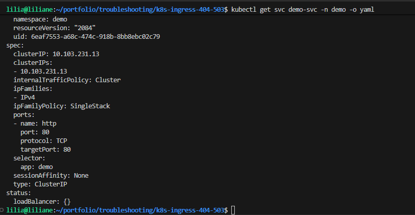

---

### 6) Confirm endpoints are empty (this explains the 503)

```bash
kubectl get endpoints -n demo demo-svc
kubectl describe endpoints -n demo demo-svc

# optional newer clusters:
kubectl get endpointslice -n demo -l kubernetes.io/service-name=demo-svc
```

If it shows **<none>**, the service is not selecting any ready pods.

**Screenshot — Endpoints are empty**
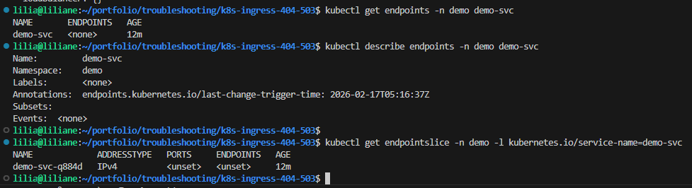

---

### 7) Check pods + labels (prove why selector doesn’t match)

```bash
kubectl get pods -n demo -o wide --show-labels
```

I confirm pods are labeled `app=demo-app`.

**Screenshot — Pods labels**
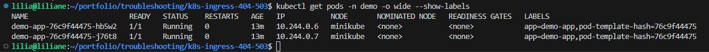

Root cause #1 for **503**:
✅ **Service selector mismatch → endpoints empty → ingress returns 503**

---

### 8) Fix #1: Update the service selector (make endpoints appear)

Edit the service:

```bash
kubectl get svc demo-svc -n demo -o yaml > /tmp/demo-svc.yaml
nano /tmp/demo-svc.yaml
kubectl apply -f /tmp/demo-svc.yaml
```

Change selector to match pods:

```yaml
selector:
  app: demo-app
```

Now re-check endpoints:

```bash
kubectl get endpoints -n demo demo-svc
```

**Screenshot — Fixed selector, endpoints now exist**
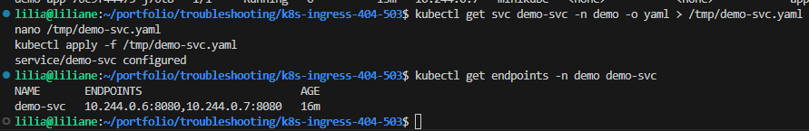

---

### 9) Fix #2: Update targetPort (prevent port mismatch / upstream failures)

Even with endpoints present, if `targetPort` is wrong, traffic can still fail.

Update service targetPort to `8080`:

```bash
kubectl patch svc demo-svc -n demo -p \
'{"spec":{"ports":[{"name":"http","port":80,"targetPort":8080}]}}'
```

Verify:

```bash
kubectl get svc demo-svc -n demo -o yaml | sed -n '1,120p'
```

**Screenshot — Service now points to targetPort 8080**
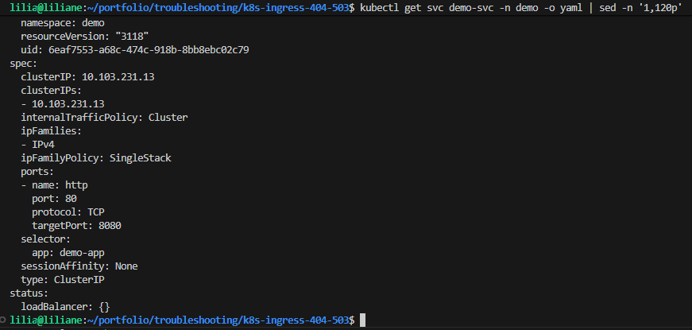

---

### 10) Final verification (curl + browser)

```bash
curl -i -H "Host: demo.local" http://$(minikube ip)/
```

Expected: **200 OK** with response body like “hello from demo-app”.

**Screenshot — Success curl (200 OK)**
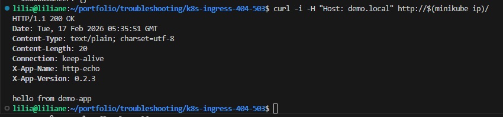

Optional browser test:

* Add a hosts entry (local machine):

  * `demo.local -> <minikube ip>`

* Windows hosts file

Make sure it has:

127.0.0.1 demo.local

```bash
kubectl -n ingress-nginx port-forward svc/ingress-nginx-controller 8080:80

sudo kubectl -n ingress-nginx port-forward svc/ingress-nginx-controller 80:80
```

Then open:

* `http://demo.local:8080`

**Screenshot — Browser success**
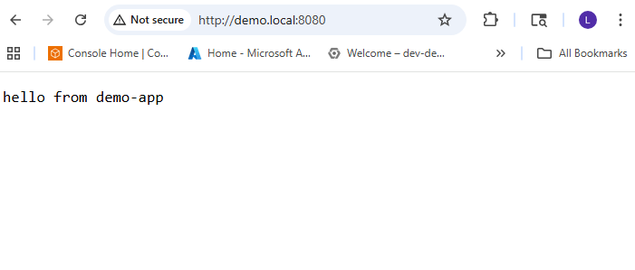

---

---

## Outcome

By troubleshooting like real ops (Ingress → Controller logs → Service → Endpoints → Pods), I restored traffic:

* **404** was caused by a **Host header mismatch** (testing the wrong host).
* **503** was caused by **service selector mismatch** (endpoints empty) and a **wrong targetPort**.
* After fixing selector + targetPort, Ingress routed correctly and returned **200 OK**.

---

## Troubleshooting Cheatsheet (what I run during incidents)

```bash
# 1) Ingress rules
kubectl describe ingress -n demo demo-ingress

# 2) Service + endpoints
kubectl describe svc -n demo demo-svc
kubectl get endpoints -n demo demo-svc

# 3) Pods + labels + readiness
kubectl get pods -n demo -o wide --show-labels
kubectl describe pods -n demo -l app=demo-app

# 4) Ingress controller logs
kubectl logs -n ingress-nginx deploy/ingress-nginx-controller --tail=100

# 5) Events (fast hint for misconfig)
kubectl get events -n demo --sort-by=.metadata.creationTimestamp | tail -n 30
```

---

## Cleanup

```bash
kubectl delete ns demo
# (Ingress addon optional)
# minikube addons disable ingress
```


