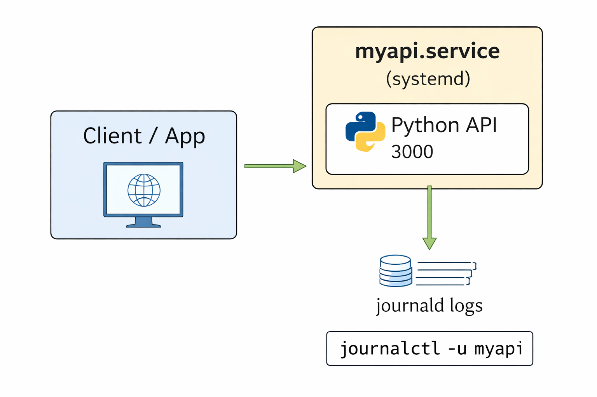
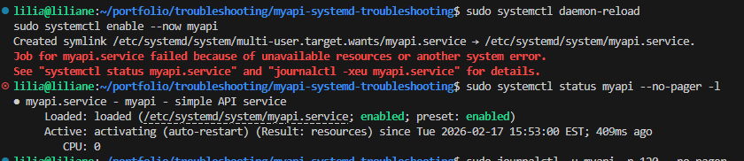
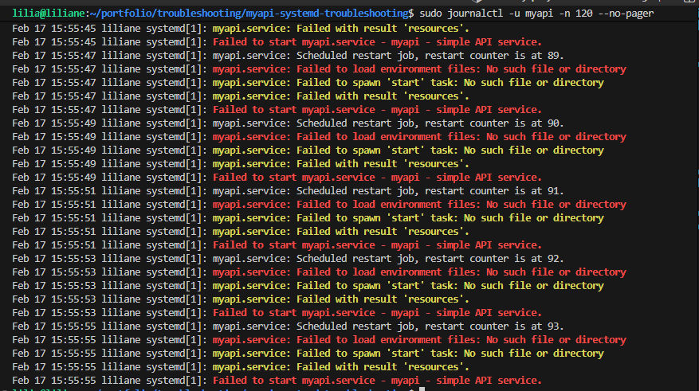
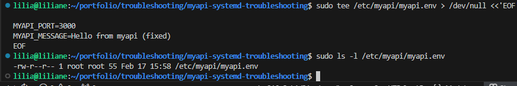
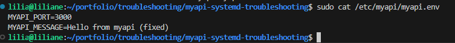
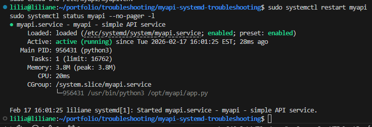
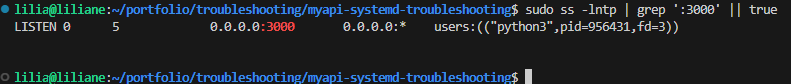
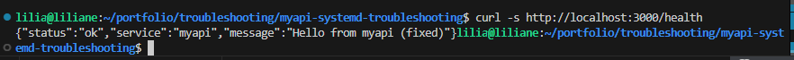
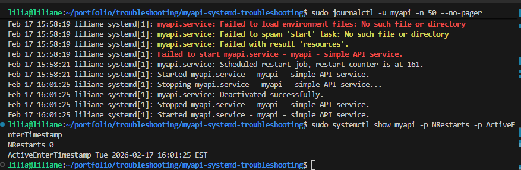

# Linux Ops Scenario: **myapi** systemd Service Failing (systemctl status + journalctl) — From Scratch Problem + Fix

## Problem

My API service **myapi** went down on a Linux server.  
Users couldn’t reach the API, and any app depending on it started failing.

When I checked systemd, I saw:

- `myapi.service` was **failed**
- systemd was trying to restart it (restart loop)
- the API port was not listening anymore

This is a real Ops situation: **find why it failed**, **fix the root cause**, and **bring it back clean**.

---

## Solution

I restored the service by doing this:

1. Confirm failure with `systemctl status myapi`
2. Read the real error with `journalctl -u myapi`
3. Reproduce the issue (missing env file = service can’t start)
4. Fix the root cause (create env file + correct permissions)
5. Reload systemd (if needed)
6. Restart service and validate it’s stable
7. Verify API response with curl

---

## Architecture Diagram



---

## Step-by-step CLI (From Scratch Setup → Break → Fix)

> Ubuntu/Debian style paths shown, but this works the same on most Linux distros (just adjust package manager if needed).

### Step 0) Create a screenshots folder (so you can capture proof as you go)

```bash
mkdir -p screenshots
```

---

### Step 1) Create the `myapi` application (simple API)

Create app folder:

```bash
sudo mkdir -p /opt/myapi
```

Create the API code:

```bash
sudo tee /opt/myapi/app.py > /dev/null <<'EOF'
from http.server import BaseHTTPRequestHandler, HTTPServer
import os

PORT = int(os.getenv("MYAPI_PORT", "3000"))
MESSAGE = os.getenv("MYAPI_MESSAGE", "myapi is running")

class Handler(BaseHTTPRequestHandler):
    def do_GET(self):
        if self.path in ("/", "/health"):
            self.send_response(200)
            self.send_header("Content-Type", "application/json")
            self.end_headers()
            self.wfile.write((f'{{"status":"ok","service":"myapi","message":"{MESSAGE}"}}').encode())
        else:
            self.send_response(404)
            self.end_headers()

    def log_message(self, fmt, *args):
        return

if __name__ == "__main__":
    server = HTTPServer(("0.0.0.0", PORT), Handler)
    print(f"myapi listening on port {PORT}")
    server.serve_forever()
EOF
```

Install Python (if not already):

```bash
sudo apt update
sudo apt install -y python3
```

Quick manual test (optional):

```bash
python3 /opt/myapi/app.py
```

In another terminal:

```bash
curl -s http://localhost:3000/health
```

Stop the manual run (Ctrl+C).

---

### Step 2) Create a dedicated user for the service

```bash
sudo useradd --system --no-create-home --shell /usr/sbin/nologin myapi || true
sudo chown -R myapi:myapi /opt/myapi
```

---

### Step 3) Create the systemd unit for `myapi`

Create the service file:

```bash
sudo tee /etc/systemd/system/myapi.service > /dev/null <<'EOF'
[Unit]
Description=myapi - simple API service
After=network.target

[Service]
Type=simple
User=myapi
WorkingDirectory=/opt/myapi
EnvironmentFile=/etc/myapi/myapi.env
ExecStart=/usr/bin/python3 /opt/myapi/app.py
Restart=on-failure
RestartSec=2
StandardOutput=journal
StandardError=journal

[Install]
WantedBy=multi-user.target
EOF
```

Reload systemd and start it:

```bash
sudo systemctl daemon-reload
sudo systemctl enable --now myapi
```

---

## The Real Failure (Simulated but realistic)

### Step 4) Service fails because the env file is missing

At this point, **I intentionally didn’t create** `/etc/myapi/myapi.env`.

So the service fails immediately.

Confirm:

```bash
sudo systemctl status myapi --no-pager -l
```

**Screenshot — myapi failed (systemctl status)**


---

### Step 5) Check logs to see the real reason

```bash
sudo journalctl -u myapi -n 120 --no-pager
```

**Realistic error you will see:**

* `Failed to load environment files: /etc/myapi/myapi.env`
* `myapi.service: Failed with result 'exit-code'`

This is a super common Ops issue: service depends on config/env file, but it’s missing or permission-blocked.

**Screenshot — journalctl shows missing env file error**


---

## The Fix

### Step 6) Create the missing env file (root cause fix)

Create the folder and env file:

```bash
sudo mkdir -p /etc/myapi
```

Create the env file:

```bash
sudo tee /etc/myapi/myapi.env > /dev/null <<'EOF'
MYAPI_PORT=3000
MYAPI_MESSAGE=Hello from myapi (fixed)
EOF
```

(Optional proof that it was missing before / exists now):

```bash
sudo ls -l /etc/myapi/myapi.env
```

**Screenshot — missing/env file check**


Show contents:

```bash
sudo cat /etc/myapi/myapi.env
```

**Screenshot — env file created (content)**


Secure permissions (real-world hygiene):

```bash
sudo chown -R root:root /etc/myapi
sudo chmod 750 /etc/myapi
sudo chmod 640 /etc/myapi/myapi.env
```

---

### Step 7) Restart the service and confirm it’s healthy

Restart and confirm it’s running:

```bash
sudo systemctl restart myapi
sudo systemctl status myapi --no-pager -l
```

**Screenshot — myapi running (systemctl status)**


Confirm it’s listening:

```bash
sudo ss -lntp | grep ':3000' || true
```

**Screenshot — port 3000 is listening**


Validate the API response:

```bash
curl -s http://localhost:3000/health
```

**Screenshot — curl health success**


Re-check logs after fix:

```bash
sudo journalctl -u myapi -n 50 --no-pager
```

Confirm stability (no restart loop):

```bash
sudo systemctl show myapi -p NRestarts -p ActiveEnterTimestamp
```

**Screenshot — restart count + stability proof**


---

## Outcome

* `myapi` was restored and stayed **Active (running)**
* Root cause was confirmed using `journalctl` (**missing env file**)
* Service restarted cleanly without restart loops
* API health endpoint returned a successful response
* I captured proof screenshots for documentation and future troubleshooting

---

## Troubleshooting (Quick Cheatsheet)

### Fast triage

```bash
sudo systemctl status myapi --no-pager -l
sudo journalctl -u myapi -n 200 --no-pager
```

### Service keeps restarting

```bash
sudo systemctl show myapi -p NRestarts
sudo journalctl -u myapi -f
```

### Check unit file + env file

```bash
sudo systemctl cat myapi
sudo systemctl show myapi -p EnvironmentFile
sudo ls -l /etc/myapi/myapi.env
```

### Validate the app manually

```bash
sudo -u myapi /usr/bin/python3 /opt/myapi/app.py
```

### Confirm port and response

```bash
sudo ss -lntp | grep ':3000' || true
curl -s http://localhost:3000/health
```


