# Terraform Ops Scenario: State Lock Blocks `terraform apply` (Real Example: S3 + DynamoDB Backend — **Local Machine**)

When Terraform uses an **S3 remote backend** with a **DynamoDB lock table**, it places a **state lock** to prevent two Terraform runs from writing state at the same time.

This is a **local-machine** ops scenario  I follow: **simulate/confirm → investigate → fix safely → verify**.

---

## Problem 

I was deploying a small change (adding tags + adjusting an ALB listener rule) from my laptop and ran:

```bash
terraform apply
````

Terraform stopped immediately with a lock error. Here’s the **real example** style of what I saw (local user):

```text
Error: Error acquiring the state lock

Error message: ConditionalCheckFailedException: The conditional request failed
Lock Info:
  ID:        8f6d3d2a-9c3b-4c7d-9d18-2f7b3b8a5b77
  Path:      my-tf-state-prod/envs/prod/terraform.tfstate
  Operation: OperationTypeApply
  Who:       liliane@my-laptop
  Version:   1.6.6
  Created:   2026-02-10 21:41:02.913 -0500 EST
  Info:      Previous apply was interrupted (terminal closed / network drop)
```

In ops, I never treat this like “just run force unlock.”
A lock can mean another apply is still running, and forcing it can cause state corruption or drift.

What matters is:

Same backend bucket + key (same terraform.tfstate path), and

Same DynamoDB lock table
---

## Solution (My Ops Order)

1. **Confirm the lock** and capture the **Lock ID**.
2. **Investigate locally**: check if any Terraform process is still running.
3. **Verify backend health** (S3 state exists + DynamoDB table reachable).
4. **Inspect the lock record** in DynamoDB (prove it’s stale).
5. If stale → **safely** remove it using:

   * `terraform force-unlock <LOCK_ID>`
6. **Verify** with `plan` then `apply` and capture proof screenshots.

---

## Architecture Diagram

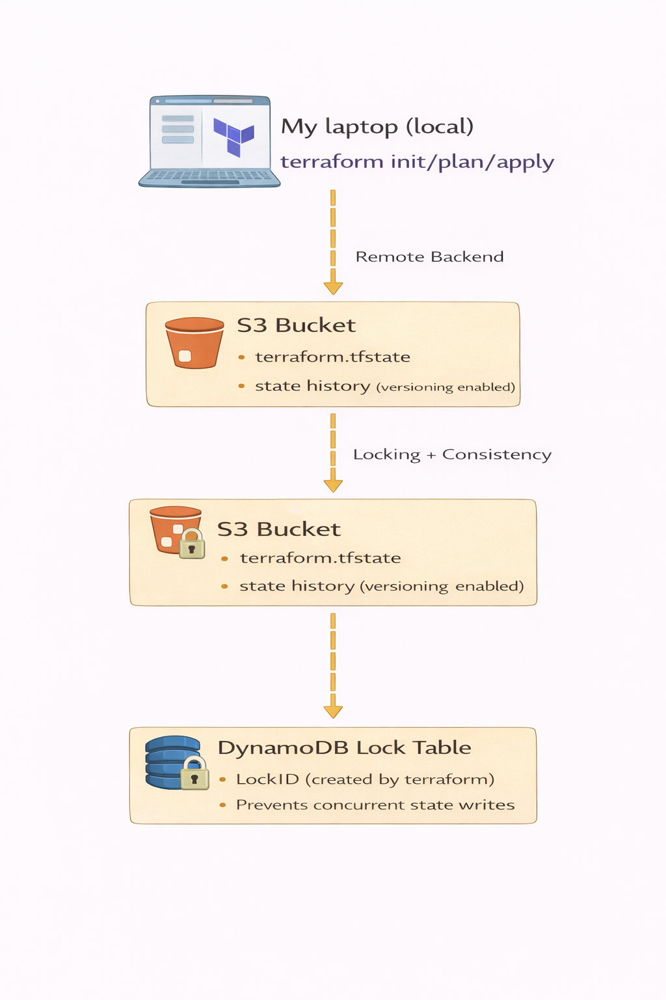

---

## Step-by-step CLI (Simulate → Investigate → Fix → Verify)

> **Environment:** AWS remote backend
> **State:** S3 object `my-tf-state-prod/envs/prod/terraform.tfstate`
> **Locking:** DynamoDB table `terraform-locks-prod`
> **Runner:** Local machine (not Jenkins)

---

## 0) Capture local Terraform version + machine proof (so it’s clearly local)

```bash

terraform version
hostname
whoami
pwd
```

**Screenshot — Local machine proof (terraform version + hostname + user)**
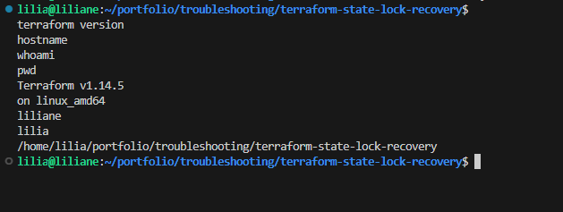

---

## 1) (Lab) Simulate the issue safely on my local machine

This reproduces a lock **without changing resources** (safe demo):

**Terminal A** (hold the lock at the confirmation prompt):

```bash
cd ~/portfolio/aws-terraform-infra/envs/prod
terraform init -reconfigure -backend-config=backend.hcl
terraform plan -var-file=prod.tfvars -out tfplan

terraform apply -var-file=prod.tfvars
# When you see: "Do you want to perform these actions?"
# DO NOT type yes — just leave it waiting.
```

**Screenshot — Terminal A holding the lock (apply prompt waiting)**
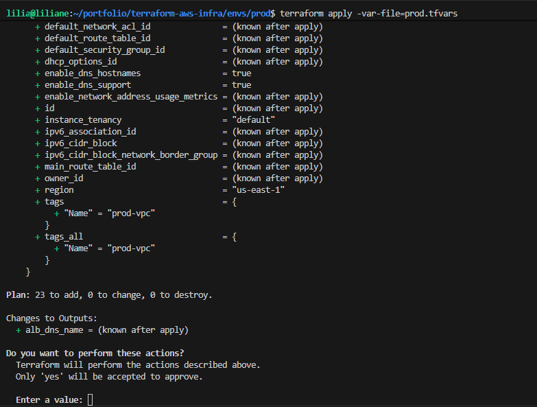

**Terminal B** (trigger the lock error immediately):

```bash
cd ~/portfolio/terraform-aws-infra/envs/prod
terraform apply -var-file=prod.tfvars -lock-timeout=0s

```

**Screenshot — Lock error in Terminal B (shows Lock ID / Who / Created / Path)**
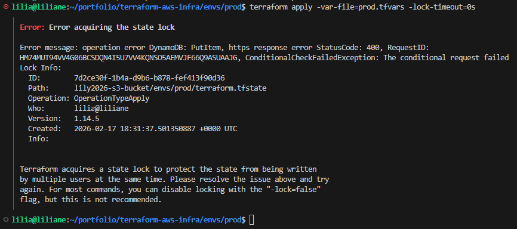

> In a real incident, this can also happen if my previous terminal crashed or my network dropped mid-run.

---

## 2) Confirm I’m in the correct repo + environment

```bash
cd ~/portfolio/terraform-aws-infra/envs/prod
ls -la
```

**Screenshot — Correct repo path + files visible**
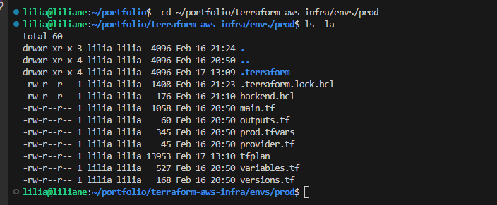

---

## 3) Re-run apply to capture lock details (Lock ID matters)

```bash
terraform apply -lock-timeout=0s

terraform apply -var-file=prod.tfvars -lock-timeout=0s

```

✅ I note:

* Lock ID: `8f6d3d2a-9c3b-4c7d-9d18-2f7b3b8a5b77`
* Who: `liliane@my-laptop`
* Created time
* State path

**Screenshot — Lock details highlighted**
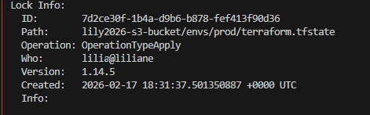

---

# Investigation Phase (Local)

## 4) Confirm no Terraform process is still running on my machine

```bash
ps aux | grep terraform
```

**Screenshot — ps output showing no active terraform apply**
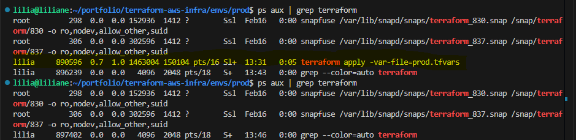

If I see a running terraform process, I stop here and let it finish (or kill it carefully only if I’m sure it’s stuck).

---

## 5) Re-initialize backend (make sure backend config is correct)

```bash
terraform init -reconfigure -backend-config=backend.hcl
```

**Screenshot — terraform init success**
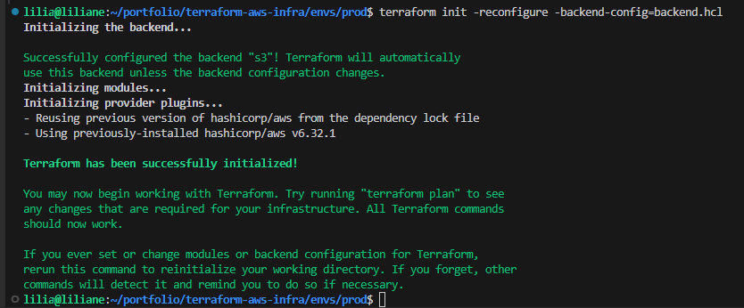

---

## 6) Verify AWS identity (correct account/role)

```bash
aws sts get-caller-identity
```

Example output:

```json
{
  "Account": "637666666662",
  "Arn": "arn:aws:sts::63766666662:assumed-role/terraform-admin/liliane",
  "UserId": "AROA...:liliane"
}
```

**Screenshot — AWS identity**
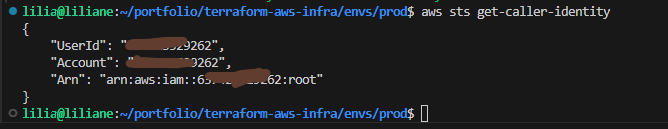

---

## 7) Confirm the state file exists in S3

```bash
aws s3 ls s3://lily2026-s3-bucket/envs/prod/terraform.tfstate

```

**Screenshot — S3 state file exists**


---

## 8) Confirm the DynamoDB lock table exists and is healthy

```bash
aws dynamodb describe-table --table-name terraform-state-lock 
```

**Screenshot — DynamoDB describe-table**
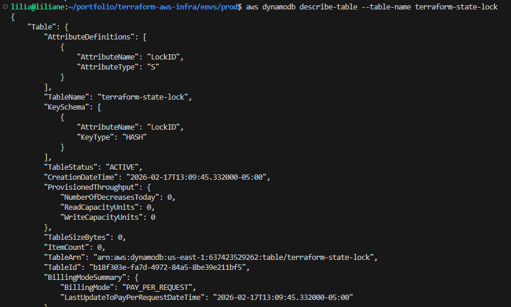

---

## 9) Inspect the lock record in DynamoDB (prove it’s stale)

```bash
aws dynamodb scan --table-name terraform-state-lock
```

What confirms it’s stale (local-machine proof):

* Lock created by `liliane@my-laptop`
* The timestamp is old (not “right now”)
* No terraform process is running locally
* I’m not running terraform in another terminal/session

**Screenshot — DynamoDB scan showing the lock entry**
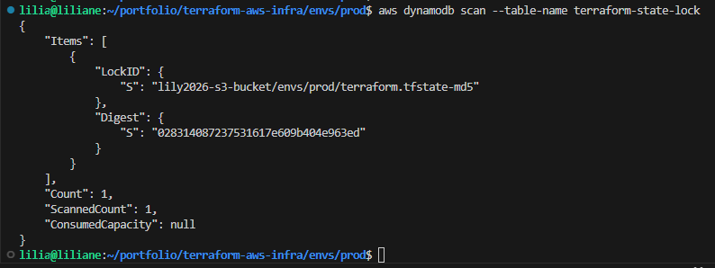

---

# Fix Phase (Only after proving it’s stale)
# Option 2 (Force-unlock proof): For this, you need a stale lock (Terraform crashed / terminal killed), because otherwise force-unlock is not necessary.

## 10) Safely release the stale lock

Copy the ID: value from the error output, then run:

```bash
terraform force-unlock fed1c142-da81-c2b0-c607-15cd5253fbae

```

Example success:

```text
Terraform state has been successfully unlocked!
```

**Screenshot — force-unlock success**
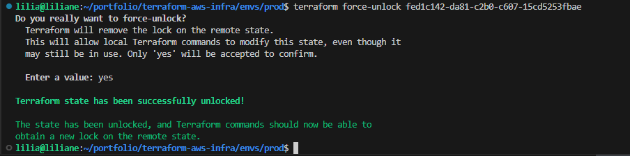

> If another terraform run is active, I do NOT do this.

---

# Verification Phase

## 11) Run plan first (I don’t jump straight to apply after unlock)

```bash
terraform plan -var-file=prod.tfvars -out tfplan
```

**Screenshot — terraform plan output**
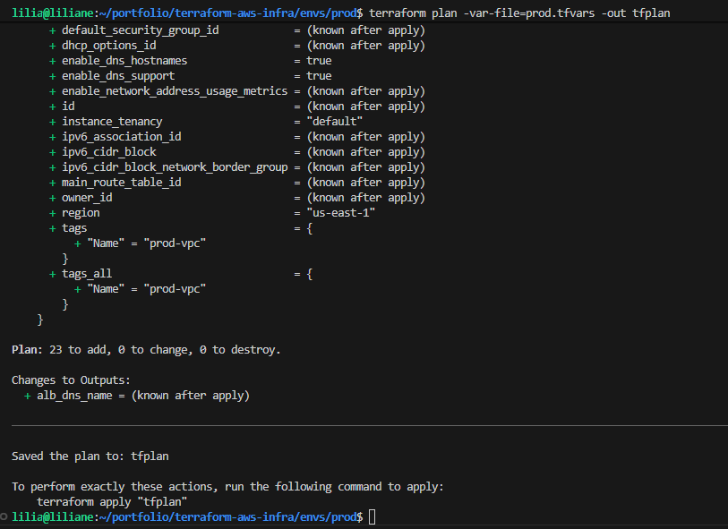

---

## 12) Apply using the saved plan (safe + consistent)

```bash
terraform apply tfplan
```

Example success:

```text
Apply complete! Resources: 2 added, 1 changed, 0 destroyed.
```

**Screenshot — apply success**
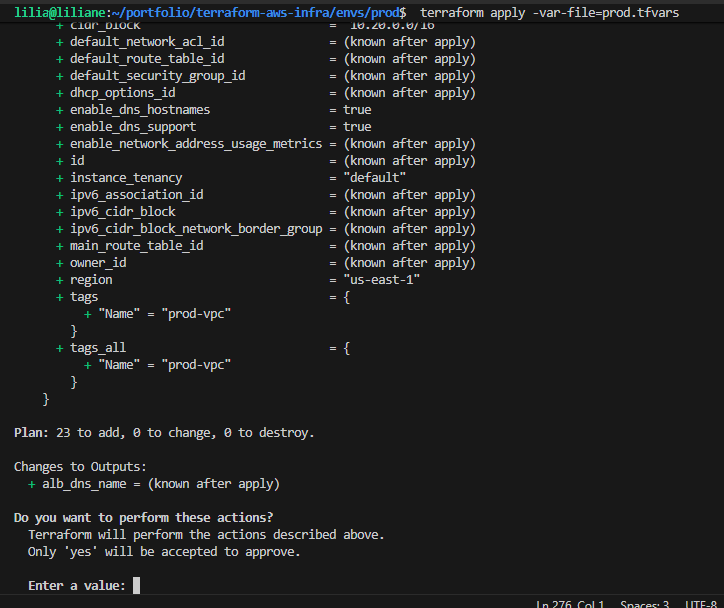

---

## Outcome

* I confirmed the lock was **not** from an active apply (it was a stale local lock).
* I safely released it without risking state corruption.
* Terraform returned to normal operations:

  * `plan` looked correct
  * `apply` completed successfully
* I kept screenshots + CLI outputs as proof for troubleshooting and audit.

---

## Troubleshooting

### 1) Lock keeps coming back (local)

That usually means:

* another terminal is still running terraform, or
* the lock is being recreated immediately because you keep retrying apply.

What I do:

* check processes: `ps aux | grep terraform`
* close duplicate terminals
* wait for the active run to finish

---

### 2) `force-unlock` says “lock not found”

Most common causes:

* lock already released, or
* wrong backend/workspace/path.

Fix:

```bash
terraform workspace show
terraform init -reconfigure
terraform apply -lock-timeout=0s
```

---

### 3) DynamoDB scan returns nothing, but Terraform still says locked

Most common causes:

* wrong table name
* wrong AWS account/region
* wrong state key/path

Verify:

```bash
aws sts get-caller-identity
aws configure get region
terraform init -reconfigure
```

---

### 4) Access denied to S3/DynamoDB

IAM permissions issue.

Checks:

```bash
aws sts get-caller-identity
aws s3 ls s3://my-tf-state-prod/
aws dynamodb describe-table --table-name terraform-locks-prod
```

---

### 5) Worst case: lock was removed during an active apply

Stop everything and validate state:

```bash
terraform plan
```

If plan shows unexpected drift, compare resources in AWS (CLI/console) and reconcile before applying again.

---


